# Perl On NetBeans

**Perl on NetBeans** is intended for Perl programmers who want the intuitiveness of a great editor with the ease of being able to execute the program without having to do it through a command Interpreter. Also, it can inspect the austerity of your Perl programs, and format the same according to the best practices and conventions.

## Fetaures

### Perl Editor
#### Perl file support
Any Perl file can be opened in the editor and all available features would be available.

  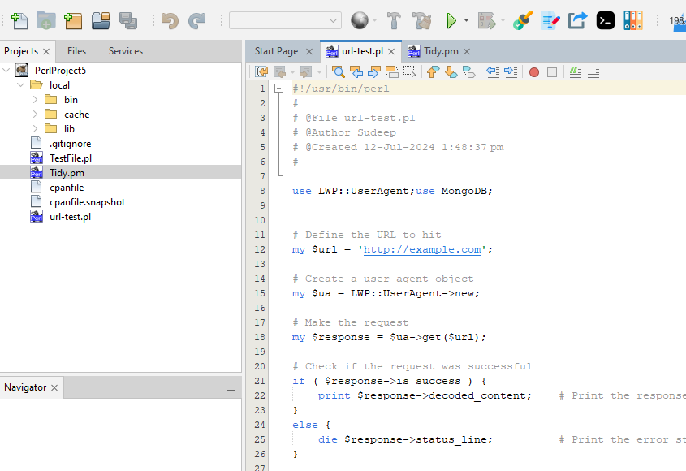

#### Perl module support
Any Perl module file can be opened in the editor and all available features would be available. 

  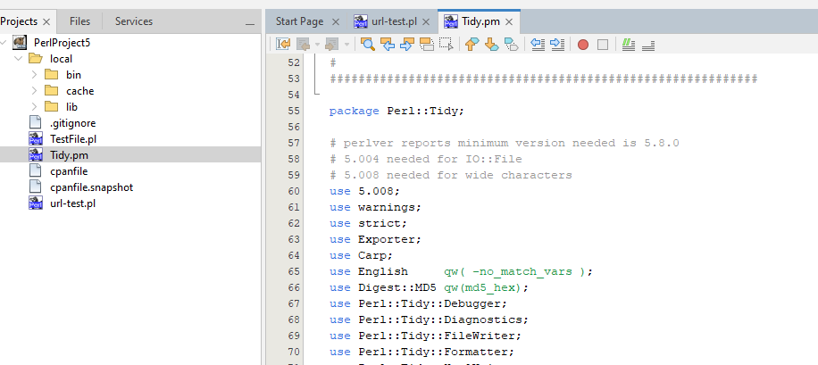

#### Syntax highlighting
As shown above, Perl files and modules are displayed with syntax highlighting in the editor. You also get the option of customizing the highlighted colors to your preference. Go to `Tools -> Options -> Fonts and Colors`. From the dropdown, select Perl and then customize as much as you want.

  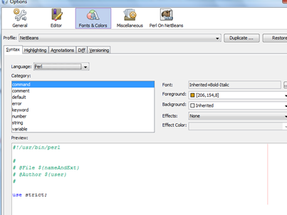

#### Brace matching
This feature lets you understand the brace completion. If you create a brace mismatch, it would be highlighted in `RED` in the editor. Else, clicking on a brace will highlight the corresponding `opening/closing` brace.

  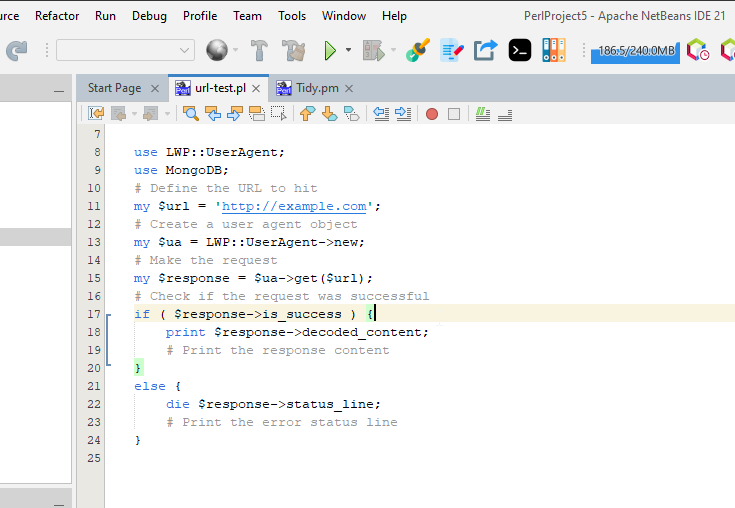

#### Export code as HTML
You can export Perl code to HTML format, using the bundled Perl::Tidy module. To do that, just open any file in the editor and click on the generate HTML button. The output HTML can be configured from the Options panel.

  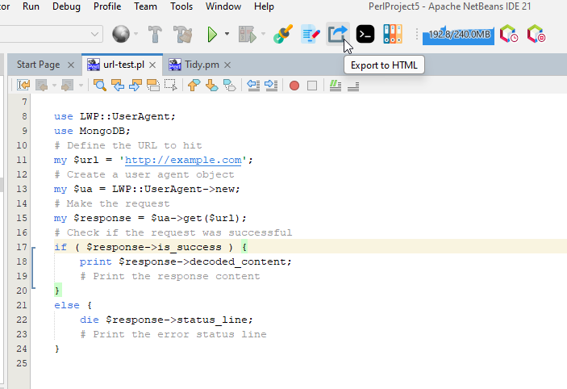

  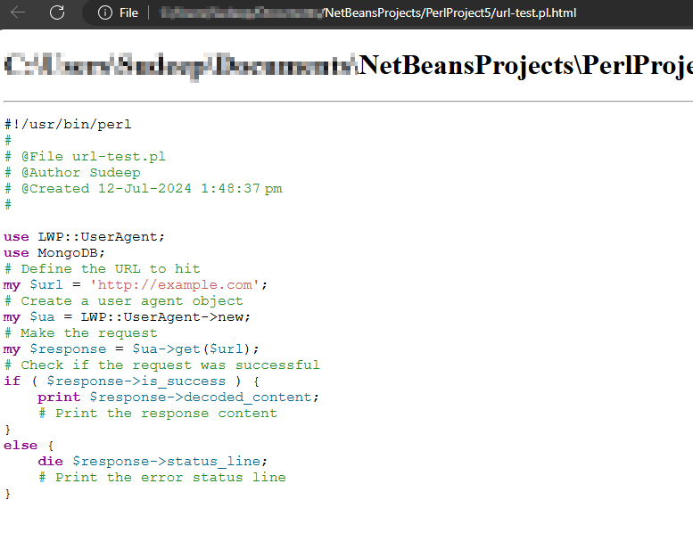

#### Toggle comments
Select any block of the code and press `Ctrl + /` to comment or un-comment the block or the following toolbar option to comment/un-comment selected blocks of code.

### Perl Project 
A Perl project can be defined as a collection of a set of Perl files that can be logically grouped together. The basic operations on a Perl Project have been outlined below.

#### Create new project
To create a new project, click on the `New Project` icon on the toolbar or select “File -> New project”. The following screen is displayed:

  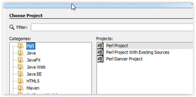

Select `Perl` in the category and `Perl Project` under `Projects`. The subsequent screen will ask for the location where you want the project to be saved and will create a folder by that name with the project sources. The IDE will also open the project for further activities. 

#### Create project with existing sources
Assuming a scenario where you have a few files that you want to create a project with and then use them. Here you can create a project with existing files using the newly available project type. Please note that all the selected files are imported to the project location and all modification would be done to the copy inside the project location.

  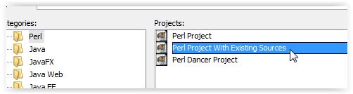

  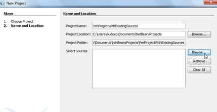

#### Open existing project
To open an already existing project, select the `Open Project` icon in the toolbar or go to `File -> Open Project`. This opens up the project selection dialog box and enable you to select am existing Perl Project to be opened. Perl project have been assigned a different icon to distinguish them from other kinds of projects, as shown below. 

  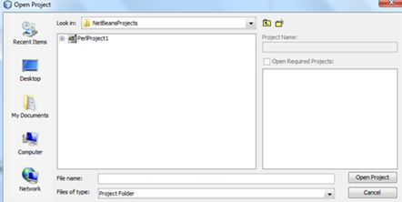

#### Add new file to project
A new file can be added to any project by Right Click on the project node and then by selecting `New ->Other` as shown below. 

  

This opens-up the subsequent window for selecting the file type and locations. Select the `Perl` category and then select `SamplePerlFile.pl` as the file type.
The subsequent windows will ask for the location where the files should be saved. This should be ideally left on the IDE to decide as it selects the code folder automatically.

#### Add existing file to project
To add an existing file to a project, select the project node and then click on the `Add existing file` icon as shown below. This will present you with another dialog window where you can select the files. Once the files are selected, they would be copied over to your project and be available under the project for all purposes.

  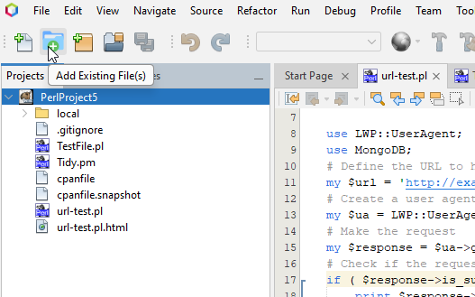

#### Project Copy/Move/Delete operations
The new version enables project level operations to copy/move/delete projects. This is an adaptation of the native project level operations on the NetBeans platform.

  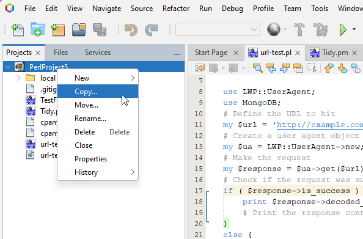

#### Support for Perl-Dancer2 projects (Incubating)
Before creating a Dancer project, the Dancer binaries need to be linked to the IDE. This needs to be done from the `Options -> Perl On Netbeans -> General` tab.
To create a Dancer project, please ensue that you have the proper modules installed. And select `New Project -> Perl Dancer Project`

  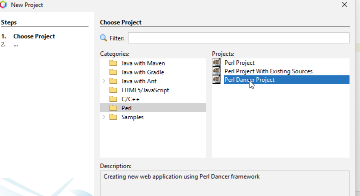

The module is used to create a template application and then you can open `bin/app.psgi` and run it 

  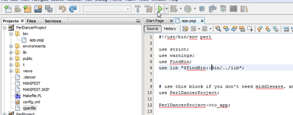

Running any other file within a `Perl Dancer` project will give the following message.

  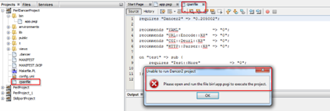

Running the `bin/app.psgi` file creates an instance of the internal webserver and launches the default page.

  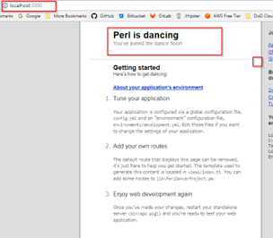

From here you can use your experience to tweak the application as you want.
> Note: Please remember to shut-down the program before you want to start it again. Else the port would be in-use and the listener cannot be installed on the default port.

### Code Execution 
#### Code execution
This feature enables you to execute the file that is currently selected in the editor. To execute any specific select it in the editor and click on the “Execute” button on the toolbar as shown below. This execution happens based on the version of the Perl compiler that is currently installed on your system or selected from the options panel *(described below)*.

  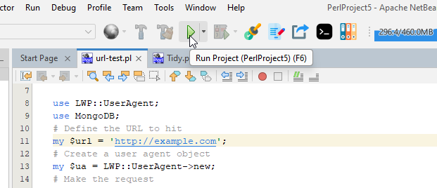

#### Code execution with command line arguments
The latest release allows one to supply command-line argument(s). To execute a file with command line options, select the file in the editor and click the “Execute (with command line options)” button on the toolbar as shown below. On using this feature, a dialog box pops up, in turn facilitating the input of command-line parameters to be used in one’s program.

  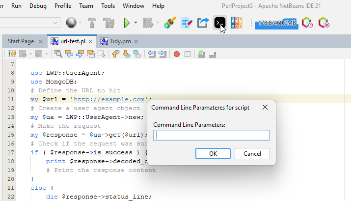

### Syntax checking
This feature enables you to check the syntax of the file that is currently selected in the editor. To execute any specific file that is currently selected in the editor, click on the `Run -> Compile File` button as shown below. This operation can be accessed using the `F9 key`. This checking happens based on the version of the Perl compiler that is currently installed on your system. 

  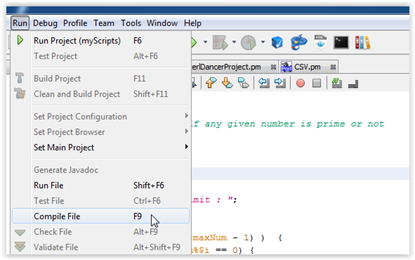

### Source code formatting (using Perl::Tidy)
This feature enables you to perform source re-formatting as per `Perl::Tidy`. To perform analysis, select the file in the editor and click on the code formatter button on the toolbar as shown below. This will run the source code formatter against the selected source. 

  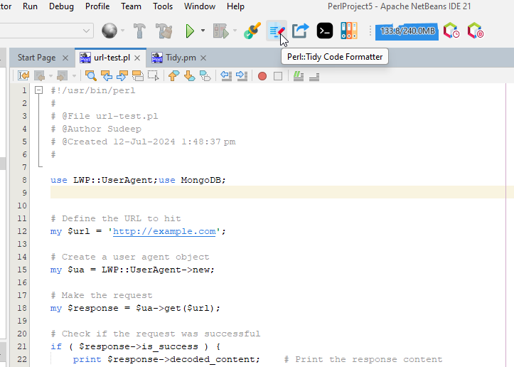

### Source code analysis (using Perl::Critic)
This feature enables you to perform source analysis as per `Perl::Critic`. To perform analysis, select the file in the editor and click on the code analyzer button on the toolbar as shown below. This will run the source code analyzer against the selected source. You’ll need Perl::Critic installed.

  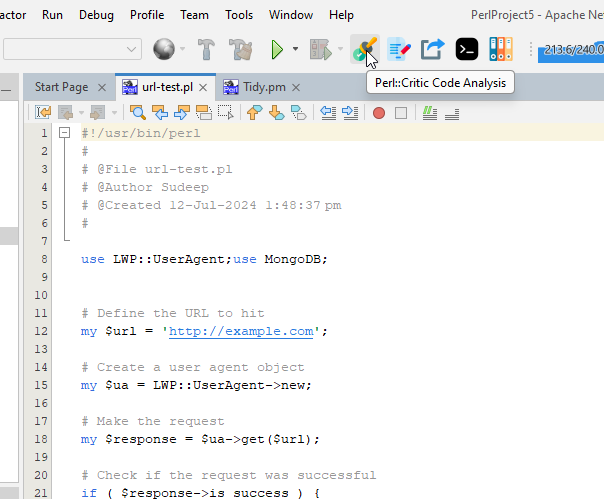

### Integrated Perl-Doc 
PerlDOC support has been also made available. If you want more information about any keyword, just select it in your editor and press on the `PerlDOC Help` button, and it will display the documentation in the output window. Similarly, if you just press the button, a pop-up window will ask you for the help topic and display it in the output window. You’ll need perl-doc installed for this.

  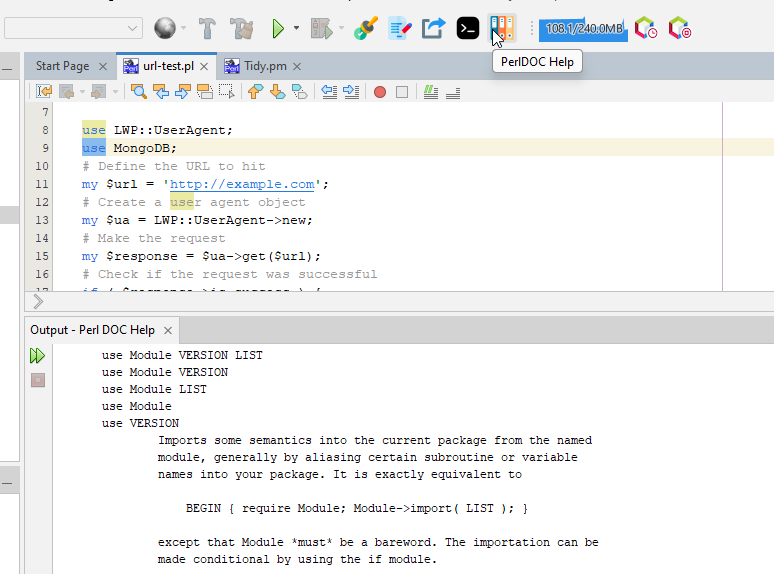

### Configuration using the Options Panel
The Options panel contains a section called `Perl OnNetBeans` for our usage. This tab contains 3 sub-tabs that are utilized for various options. Also template support has been added for programming efficiency.

#### Templates
You can specify any code template that you use regularly as a shortcut here. For example `p` can translate to `print`. So, if you add a template here, and then go to your editor with a Perl file open, type `p` and press `tab`, and voila, this would get translated in the editor as `print`. You can add as many templates as you want.

  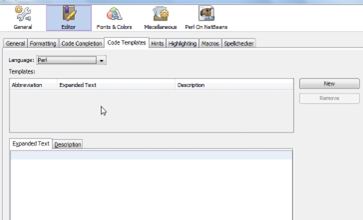

#### General Options
This tab contains the option to over-ride the default Perl installed on your machine. Let’s say that you have Perl 5.14 installed on your machine as the default but you want to use Perl 5.16 available at a non-default location, you can point the perl.exe binary using this tab and your program will be operated on by the executable specified here. If you do not specify anything here, the default Perl will be used. 
You can also specify any custom library file location here. These locations would be used as an addition to your @INC in the script.
Also, the Dancer2 executables need to be pointed to at this location. The Dancer2 Path should be the folder where the Dancer2 and Plackup scripts are installed. This is not required to be populated if Dancer2 is installed with the default Perl installation at the default location.

  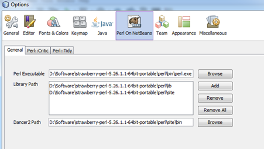

#### Perl Tidy
This tab can be used to customize the code formatting options. For a complete meaning of the options here, please refer to the URL http://perltidy.sourceforge.net/perltidy.html.   

  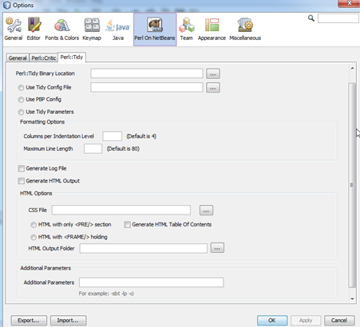

#### Perl Critic
This tab can be used to customize the code analysis options. For a complete meaning of the options here, please refer to the URL http://linux.die.net/man/1/perlcritic. 

  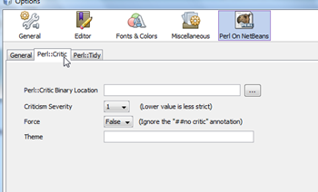

#### Integrated versioning system (SVN/Git/Hg)
The new version also includes integrated support for major code versioning systems including Subversion, Git and Mercurial. The appropriate context menu options are displayed based on whether the code is connected with a SVN/Git/Hg repository. 